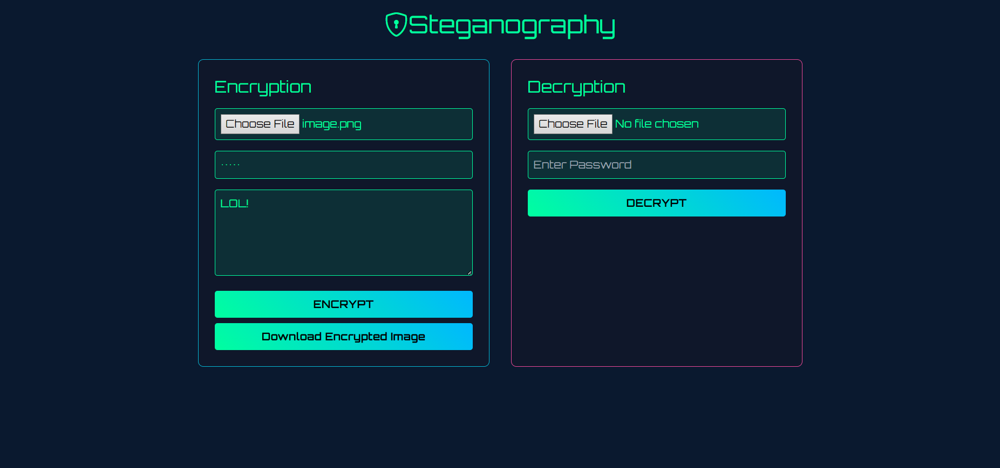
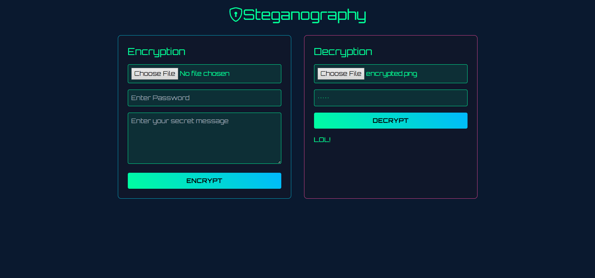

```markdown
# 🛡️ Cyberpunk Steganography

A Flask-based image steganography tool that hides and extracts secret messages in images.

## 🚀 Features
- Encrypts secret messages into images.
- Decrypts hidden messages with a passcode.
- Supports various image formats.
- Web-based UI using Tailwind CSS.

## 🛠️ Installation

1. Clone the repository:
   ```bash
   git clone https://github.com/devjindal135/Stenography.git
   cd Stenography
   ```

2. Install dependencies:
   ```bash
   pip install -r requirements.txt
   ```

3. Run the application:
   ```bash
   python app.py
   ```

4. Open the app in your browser:
   ```
   http://127.0.0.1:5000
   ```

5. Local Enviroment:
   ```
   Go To: https://github.com/devjindal135/Stenograph.git
   ```

## 📸 Screenshots



## 📝 Usage
1. Upload an image and enter a secret message + passcode.
2. Click **"Encrypt"** to generate an encrypted image.
3. Upload the encrypted image and enter the passcode to **"Decrypt"**.

## 🌍 Deploy on Vercel
1. Install Vercel CLI:
   ```bash
   npm install -g vercel
   ```
2. Deploy:
   ```bash
   vercel
   ```
3. Open the assigned Vercel URL.

## 🤝 Contributing
Pull requests are welcome! Please open an issue for discussion.

